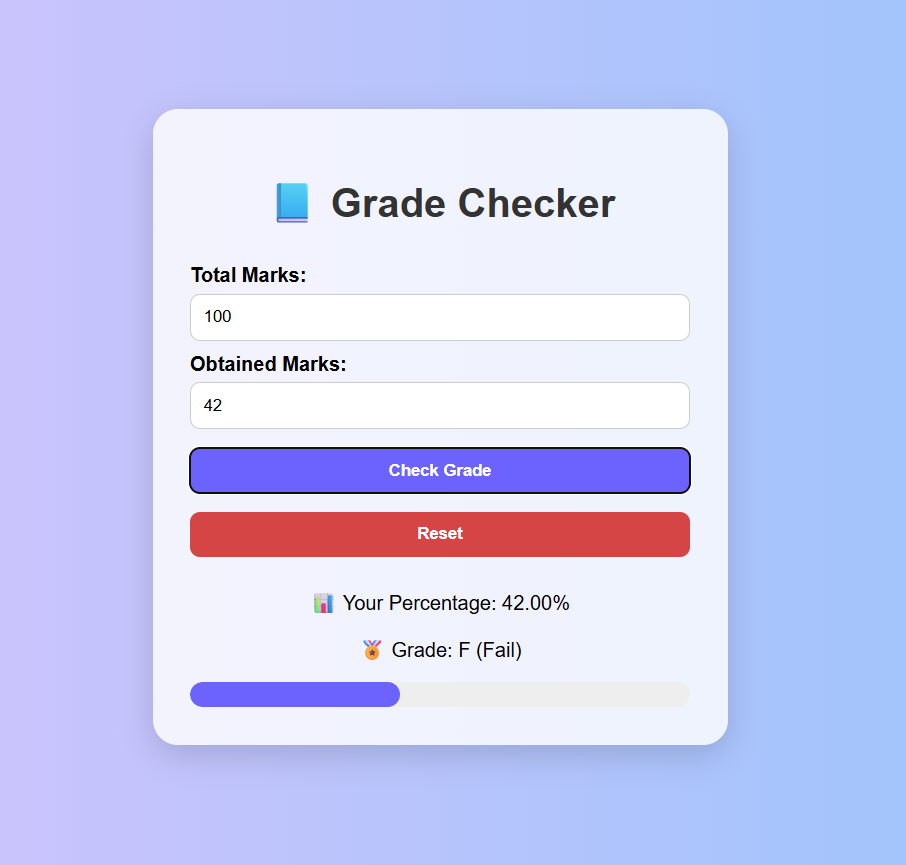
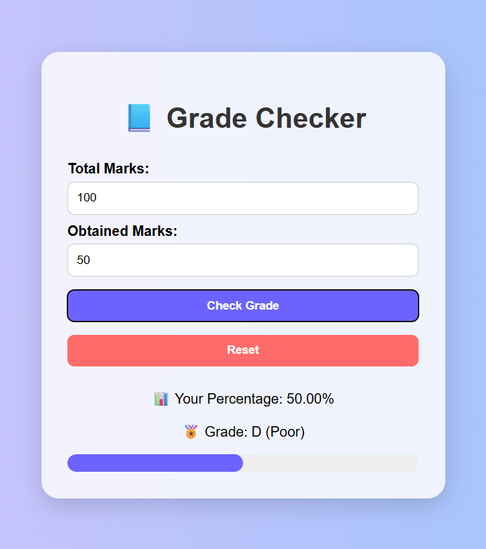
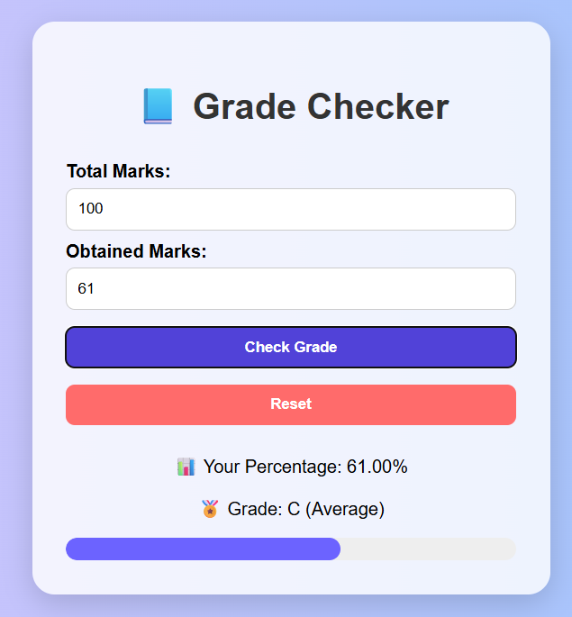
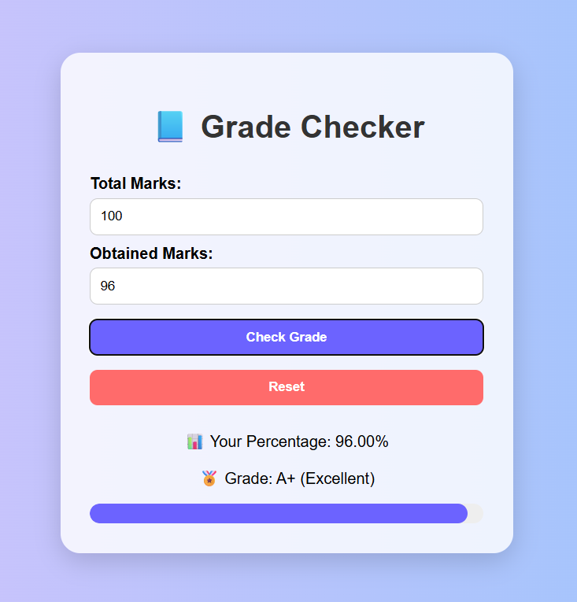

# 📘 Responsive Grade Checker Web App

A beautiful, interactive web application that calculates percentage and assigns grade using HTML, CSS, and JavaScript.

## 🌟 Features
- Responsive design (mobile/tablet/desktop)
- Calculates percentage and grade
- Visual progress bar
- Reset button
- Validates inputs

## 💻 Technologies
- HTML5
- CSS3 (modern design, gradients, shadows)
- JavaScript (DOM & logic)

## 📸 Screenshots

## ▶️ How to Run

Just open `index.html` in your browser — or deploy it on GitHub Pages.

## 🔗 Live Preview (Optional)
To be added when deployed.

## ✍️ Author
**Sanskruti Pramod Varade**
