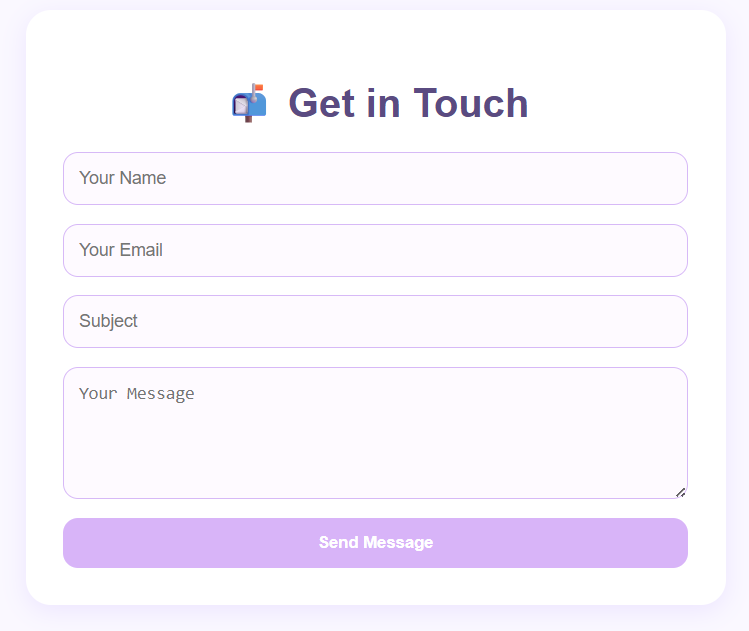
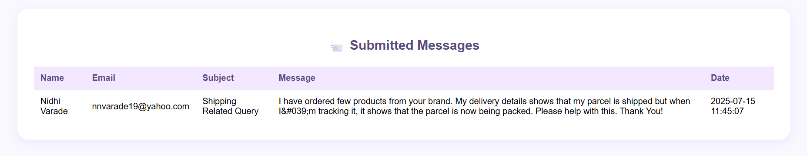

# 📬 Contact Form with MySQL Integration

A simple, elegant, and pastel-themed Contact Form built using **HTML, CSS, PHP, and MySQL**.  
It collects user messages and stores them securely in a database, with an admin view to track submissions.

---

## 🌟 Features

- 💬 Fully functional contact form (Name, Email, Subject, Message)
- 💾 Saves messages to a MySQL database
- 🎨 Responsive and pastel-styled UI (mobile-friendly)
- 🛠️ Admin panel to view all submitted messages
- 🔒 Safe data handling with prepared statements

---

## 🖼️ Screenshots

> 💡 Contact Form UI  


> 📑 Admin View of Messages  


---

## 🛠️ Tech Stack

| Layer     | Technologies          |
|-----------|------------------------|
| Frontend  | HTML5, CSS3 (pastel UI) |
| Backend   | PHP (procedural)       |
| Database  | MySQL (via phpMyAdmin) |

---

## 📁 How To Run Locally

1. Start Apache & MySQL using XAMPP
2. Import the database:

```sql
CREATE DATABASE contact_form_db;

CREATE TABLE messages (
  id INT AUTO_INCREMENT PRIMARY KEY,
  name VARCHAR(100),
  email VARCHAR(100),
  subject VARCHAR(150),
  message TEXT,
  submitted_at TIMESTAMP DEFAULT CURRENT_TIMESTAMP
);

3. Place this folder inside:
C:/xampp/htdocs/Intermediate-Projects/Contact_Form_With_DB/

4. Open in browser -
http://localhost/Intermediate-Projects/Contact_Form_With_DB/index.html

5. View admin panel -
http://localhost/Intermediate-Projects/Contact_Form_With_DB/view_messages.php

🧠 Learning Highlights
Connecting PHP with MySQL using mysqli
Using POST method and prepared statements for security
Frontend + Backend integration in a clean full-stack mini app

👩‍💻 Author
Sanskruti Pramod Varade
🎓 Master’s in Computer Science
🌐 GitHub: enveeee
📍 Nashik, Maharashtra, India
