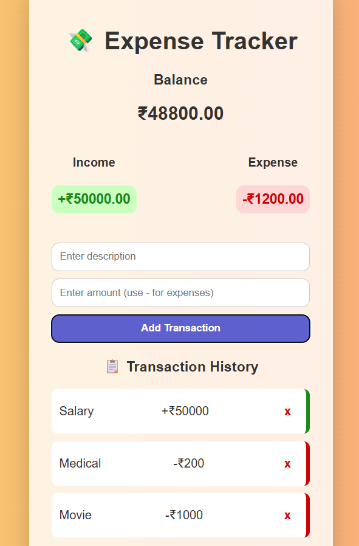

# 💸 Expense Tracker Web App

A modern, mobile-friendly Expense Tracker that allows you to record income and expenses, view totals, and persist data using local storage.

## 🚀 Features
- Add & delete income/expenses
- Real-time balance update
- Responsive UI (pastel + glassmorphism)
- Saves data in browser (localStorage)

## 📸 Screenshots

# 🛠 Tech Stack 
HTML5
CSS3
JavaScript (ES6)
Local Storage

# ▶️ Run Locally
Clone the repo or download ZIP
Open index.html in your browser

✍️ Author
Sanskruti Pramod Varade