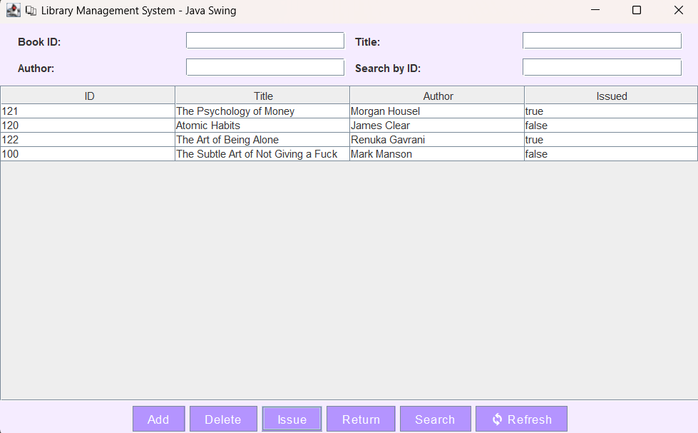
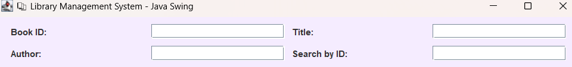

# 📚 Library Management System - Java Swing GUI

An interactive **Library Management System** built using **Java Swing** for GUI and **File Handling** for persistent data storage.  
This project helps manage books with options to add, search, issue, return, and delete books through a modern pastel-styled interface.

---

## 🖥️ Features

- ➕ Add New Book (ID, Title, Author)
- 🔍 Search for Books by ID
- 📋 Display All Books in JTable
- ✔️ Issue or 🔄 Return Book
- ❌ Delete Book from the Library
- 🎨 Pastel UI with Responsive Swing Components

---

## 📸 Screenshots

> 📋 Main Interface  

> ➕ Add Book  

> ✔️ Issue Book  

---

## 🛠️ Tech Stack

| Component     | Technology        |
|---------------|-------------------|
| Language      | Java (OOP)         |
| GUI Framework | Java Swing         |
| Data Storage  | File (`books.txt`) |

---

## 📂 Folder Structure

Library_Management_System_Java/
├── src/
│ ├── Book.java
│ ├── LibraryManager.java
│ └── LibraryGUI.java
├── books.txt
├── assets/
│ └── screenshots/
│ ├── main_ui.png
│ ├── add_book.png
│ └── issue_book.png
└── README.md

---

## 🚀 How To Run

### 1️⃣ Prerequisites:
- Java installed (`java -version`)
- Any Java IDE (VS Code, IntelliJ, NetBeans)

### 2️⃣ Steps:

1. Clone or download this repository  
2. Create a blank text file named `books.txt` in the project root  
3. Open the `src/LibraryGUI.java` in your IDE  
4. Run the `main()` method

---

## 💡 Learning Highlights

- Java File I/O: Read/Write Book data
- Java Swing GUI Design
- JTable integration and form design
- OOP principles with clean modular code

---

## 👩‍💻 Author
*Sanskruti Pramod Varade*  
🎓 Master’s in Computer Science  
🌈 Pastel-themed Portfolio Projects  
🌐 [GitHub: enveeee](https://github.com/enveeee)

---

## 📌 License
This project is open-source and free to use for learning and personal use. ✨
