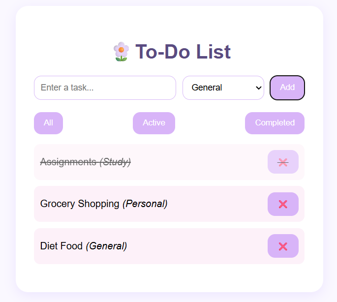
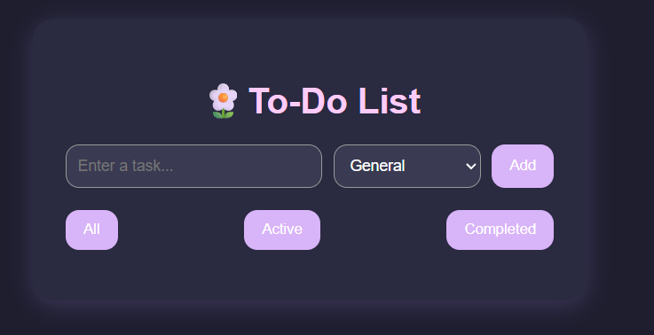
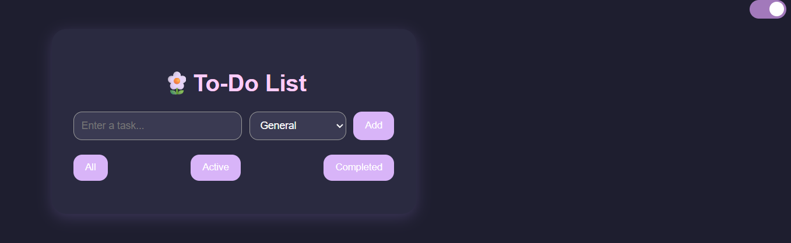
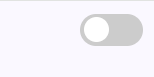

# 🌸 Pastel To-Do List Web App

A visually aesthetic, pastel-themed To-Do List application built using **HTML, CSS, and JavaScript**. This project offers smooth interactivity, responsive design, dark mode support, and category filters to enhance task management. It's designed for clean UX and appealing UI — perfect for showcasing in a developer portfolio.

---

## ✨ Features

- ✅ Add, delete, and mark tasks as complete
- ✅ Filter tasks by: **All**, **Active**, **Completed**
- ✅ Assign categories: **General**, **Study**, **Work**, **Personal**
- ✅ Responsive layout for all devices
- ✅ Dark mode toggle
- ✅ Soft pastel-themed UI with animations

---

## 📸 Screenshots

> Light Mode  


> Dark Mode  


> Category Selection  



---

## 🛠️ Technologies Used

- HTML5  
- CSS3 (with transitions, pastel theme, media queries)  
- Vanilla JavaScript (DOM manipulation, filtering, events)

---

## 🚀 How to Run This Project

1. **Clone or download** this repository  
2. Open the `index.html` file in your browser  
3. Start managing your tasks beautifully 🌈  

```bash
git clone https://github.com/username/My-Portfolio-Projects.git
cd Intermediate-Projects/ToDo-List
open index.html

🧠 Learning Outcomes
DOM Manipulation & Event Handling
Responsive and aesthetic front-end UI development
Clean project structure and documentation
Vanilla JavaScript logic implementation

👩‍💻 Author
Sanskruti Pramod Varade
📍 Nashik, Maharashtra, India
🎓 M.Sc. Computer Science
🌐 GitHub : enveeee

💖 Acknowledgement
This project is a creative pastel-themed web app built with love for personal learning and portfolio use.
