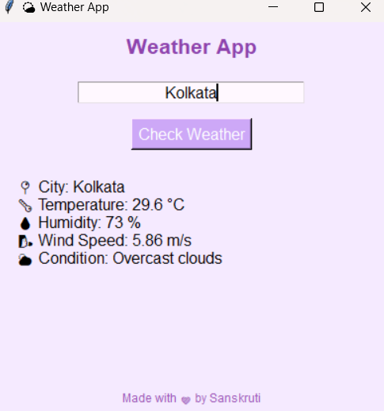
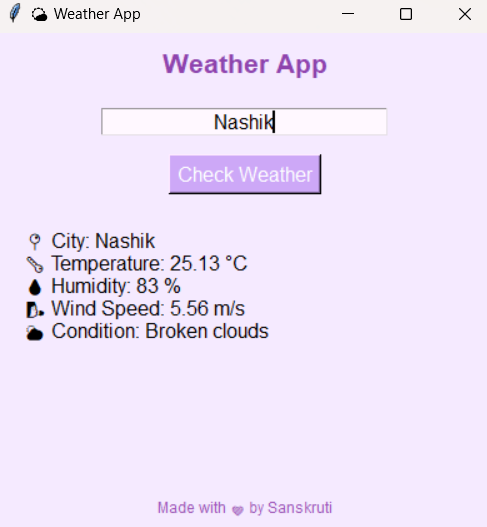

# 🌤️ Weather App - Python + OpenWeatherMap API

A minimalist, pastel-themed **Weather Forecast App** built using **Python** and the **OpenWeatherMap API**.  
This application lets users check the **real-time weather** of any city, including temperature, humidity, wind speed, and conditions.

---

## 📸 Screenshots

> 💜 Pastel GUI Interface  




---

## 🛠️ Tech Stack

| Component    | Technology               |
|--------------|---------------------------|
| Language     | Python                    |
| API          | OpenWeatherMap (REST API) |
| GUI Library  | Tkinter                   |
| Theme        | Pastel Lavender 🎨        |

---

## 🎯 Features

- 📍 Input any city name
- 🌡️ Temperature in °C
- 💧 Humidity & Wind speed
- 🌥️ Weather condition (e.g., Clear, Rain)
- ❗ Error handling for invalid city names
- 💅 Beautiful pastel GUI (responsive layout)

---

## 🚀 How to Run

### 🧰 Prerequisites:

- Python installed (`python --version`)
- Install `requests` library:
```bash
pip install requests

📝 Steps:
1. Sign up at OpenWeatherMap and get your API Key

2. Paste it in the script at:
API_KEY = "your_api_key_here"

3. Run the script:
python weather_app_gui.py

📁 Folder Structure
Weather_App_Python/
├── weather_app_gui.py
├── README.md
└── assets/screenshots
    └── screenshot1.png

📚 What I Learned
How to use OpenWeatherMap API in Python
Basics of REST API calls with requests
Designing a cute GUI using Tkinter
Handling user input and exceptions

👩‍💻 Author
Sanskruti Pramod Varade
🎓 Master’s in Computer Science
🦋 Aesthetic & Practical Python Projects
🔗 GitHub - @enveeee

📌 License
This project is open-source for learning and personal development. 🌼
